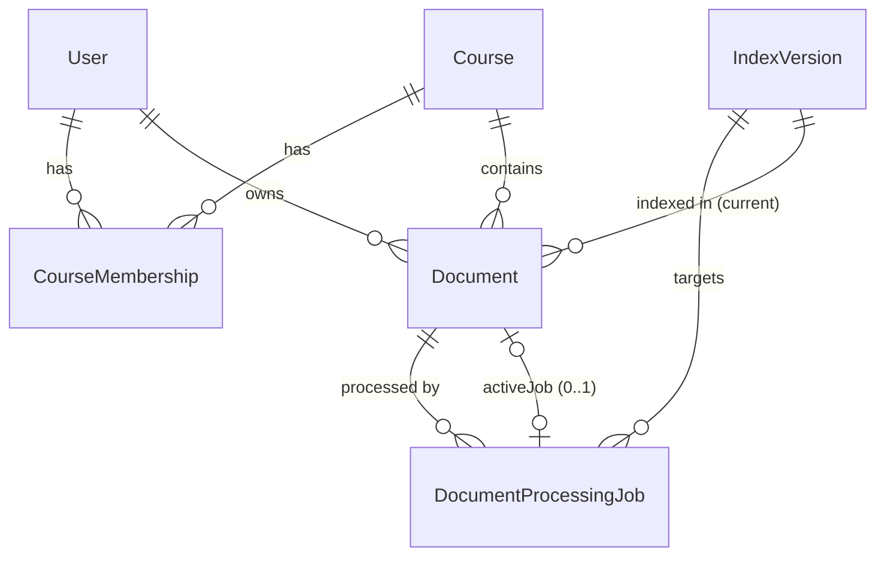

# Data Model (MySQL + Prisma) and Storage Ownership

No Prisma schema exists in the repository on any branch. This is the **proposed** WBS-4
schema. Field and enum names are binding for the cross-module contracts; WBS-4 may add
columns.

## 1. Where data lives

| Data | MySQL | ChromaDB | Storage volume |
| --- | --- | --- | --- |
| Document identity, owner, course, visibility, title, original filename, MIME type, size, SHA-256 | **Authoritative** | Copies only: `document_id`, `course_id`, `owner_id`, `document_title`, `document_type` | — |
| Processing status, errors, jobs, attempts | **Authoritative** | — | — |
| Page count | **Authoritative** (from SUCCEEDED event) | Copy (`page_count`) | — |
| Index versions / embedding configuration | **Authoritative** (`IndexVersion`) | Collection stamp (must match) | — |
| Chunk text, page range, offsets, section, vectors | — (only `chunkCount`) | **Authoritative** | — |
| Original PDF | `storageKey` | — | **Authoritative** (`documents/{id}/original.pdf`) |
| Extracted page text | `indexingVersion` (which artifact is current) | — | **Authoritative** (`documents/{id}/pages.{indexing_version}.json`) |
| Grounded answers (later) | `QaInteraction.payload` | — | — |

**Rules**
- **ChromaDB is a derived index.** It can always be rebuilt from storage plus MySQL.
- **Copies in ChromaDB may lag** (for example, titles, see ADR-012). NestJS overlays current
  values from MySQL when responding.
- **Never decide access from ChromaDB metadata.** `owner_id` there is informational only.

## 2. MVP entities



### User
| | |
| --- | --- |
| PK | `id` (cuid) |
| Fields | `email` (unique), `displayName`, `passwordHash`, `role` `USER`/`ADMIN`, `createdAt` |
| Ownership / lifecycle | WBS-4. Created by seed or registration (auth details: unresolved U1). Deactivation removes access via memberships; their documents remain. |

### Course
| | |
| --- | --- |
| PK | `id` (cuid). Satisfies the WBS-3 `Identifier` pattern `^[A-Za-z0-9][A-Za-z0-9_.:\-]{0,127}$`. |
| Fields | `code` (e.g. `BIL 211`), `name`, `instructorName`, `term`, `createdAt` |
| Constraints | `@@unique([code, term])` |
| Lifecycle | **Admin-seeded** (decision A1). No course-management UI in Phase 1. |

Per-user frontend fields (`upcoming`, `lastStudied`, `lastTopic`) are **derived**, not
columns.

### CourseMembership
| | |
| --- | --- |
| PK | `@@id([userId, courseId])` |
| Fields | `role` `STUDENT`/`INSTRUCTOR`, `createdAt` |
| Indexes | `@@index([courseId])` |
| Lifecycle | Seeded by admin. Removing a membership removes access immediately (scope is derived per request). |

### Document
| | |
| --- | --- |
| PK | `id` (cuid, generated **by the application** before insert; never reused) |
| Fields | `courseId`, `ownerId`, `visibility` `PRIVATE`/`COURSE`, `documentType` (`slide`/`notes`/`textbook`/`past_exam`/`other`), `title`, `originalFilename`, `mimeType`, `sizeBytes`, `contentSha256`, **`activeContentHash`** (nullable dedup key, §4), `storageKey`, `pageCount?`, `chunkCount?`, `status` (§3), `failedStage?`, `errorCode?`, `errorMessage?`, `errorRetryable?`, **`activeJobId?` (unique)**, `indexingVersion?` (of the READY content), `indexVersionId?` (collection of the READY content), `readyAt?`, `createdAt`, `updatedAt`, `deletedAt?`, `purgedAt?` |
| Constraints | `@@unique([courseId, ownerId, activeContentHash])`; `activeJobId @unique` |
| Indexes | `@@index([courseId, status, deletedAt])`, `@@index([ownerId])`, `@@index([deletedAt, purgedAt])` |
| Ownership | Row: WBS-4. `status`/`page*`/`chunk*` columns change **only** through validated job events. |
| Lifecycle | [document-lifecycle.md](document-lifecycle.md) |

### DocumentProcessingJob
| | |
| --- | --- |
| PK | `id` (cuid) |
| Fields | `documentId`, `indexVersionId`, `kind` `INITIAL`/`RETRY`/`REINDEX`/`MIGRATION`, `status` `QUEUED`/`DISPATCHED`/`RUNNING`/`SUCCEEDED`/`FAILED`/`CANCELLED`, `stage?`, `attempt` (1-based within one processing episode), `indexingVersion`, `lastEventSeq` (default 0), `workerId?`, `nextAttemptAt?`, `dispatchedAt?`, `startedAt?`, `heartbeatAt?`, `finishedAt?`, `pageCount?`, `chunkCount?`, `errorCode?`, `errorMessage?`, `retryable?`, `createdAt` |
| Indexes | `@@index([status, heartbeatAt])`, `@@index([status, nextAttemptAt])`, `@@index([documentId, createdAt])`, `@@index([indexVersionId, status])` |
| Lifecycle | Terminal states (`SUCCEEDED`, `FAILED`, `CANCELLED`) are immutable. Rows are kept as an audit trail. |

### IndexVersion
| | |
| --- | --- |
| PK | `id` (cuid) |
| Fields | `collectionName` (unique, e.g. `knot_chunks_v1`), `embeddingBackend`, `embeddingModel`, `embeddingRevision?`, `embeddingDimension`, `queryPrefix`, `documentPrefix`, `normalize`, `distance` (`cosine`), `embeddingFingerprint` (unique), `chunkerVersion` (default `indexing_version` for new jobs), `status` `BUILDING`/`ACTIVE`/`RETIRED`, `activatedAt?`, `retiredAt?`, `droppedAt?` |
| Constraints | **At most one `ACTIVE`**, enforced in the activation transaction (`SELECT … FOR UPDATE` on the current ACTIVE row) |
| Lifecycle | [document-lifecycle.md §8](document-lifecycle.md#8-embedding-model-change-bluegreen-migration) |

## 3. Enums (binding names)

```text
DocumentStatus     UPLOADED | EXTRACTING | CHUNKING | EMBEDDING | INDEXING | READY | FAILED | DELETING
JobStatus          QUEUED | DISPATCHED | RUNNING | SUCCEEDED | FAILED | CANCELLED
JobKind            INITIAL | RETRY | REINDEX | MIGRATION
Visibility         PRIVATE | COURSE
MembershipRole     STUDENT | INSTRUCTOR
UserRole           USER | ADMIN
IndexVersionStatus BUILDING | ACTIVE | RETIRED
DocumentType       slide | notes | textbook | past_exam | other     (= WBS-3 DocumentType values)
```

## 4. Duplicate uploads with soft deletion

MySQL has no partial (filtered) unique index, so `UNIQUE(courseId, ownerId, contentSha256)`
would also block re-uploading a deleted file. Instead:

- **Dedup key:** `activeContentHash` = `contentSha256` while the document is not deleted, and
  **`NULL` once deleted**. The column is set to `NULL` in the same transaction that sets
  `deletedAt`.
- **Constraint:** `@@unique([courseId, ownerId, activeContentHash])`. InnoDB unique indexes
  allow any number of `NULL`s, so deleted rows never conflict. Prisma supports this with a
  nullable field in `@@unique`.

| Case | Behaviour |
| --- | --- |
| Same user uploads the same file to the same course while the first copy exists (any status, including FAILED) | `409 DUPLICATE_DOCUMENT` with `details.existing_document_id`. A FAILED copy should be retried or deleted, not duplicated. |
| Re-upload after deletion | Allowed: the deleted row has `activeContentHash = NULL`. The new upload gets a **new `document_id`**, so it cannot collide with stale chunks of the old one. |
| Same file uploaded by a different user (private copies) | Allowed: the key includes `ownerId`. Each copy is indexed separately and is visible only to its owner. |
| Student uploads a file identical to a COURSE document | Allowed (different owner). The response includes `notices: ["SAME_AS_COURSE_DOCUMENT"]` so the UI can suggest using the shared copy. Retrieval deduplicates identical text in context (WBS-3 `ContextBuilder`). |
| Instructor uploads the same file privately and to the course | Blocked (same owner and course). Phase 1 has no visibility change; delete and re-upload. |
| Two concurrent identical uploads | Both stream to `tmp/`. The first `INSERT` wins; the second fails with Prisma `P2002`, which NestJS maps to `409 DUPLICATE_DOCUMENT` and then deletes its temp file. No application-level pre-check is relied on. |

Upload sequence (all in NestJS):
1. Stream to `tmp/{uuid}`, computing SHA-256 and checking the `%PDF-` magic bytes and size
   limit.
2. Generate `document_id`.
3. `INSERT` the Document (`UPLOADED`, `activeContentHash = sha`). On `P2002`, return 409.
4. Atomically rename the temp file to `documents/{id}/original.pdf` (same volume).
5. Create the job ([document-lifecycle.md §3](document-lifecycle.md#3-job-creation-and-dispatch)).

If step 4 fails, the insert is compensated: the row is hard-deleted, which is safe because no
job, chunk or artifact exists yet.

## 5. Proposed Prisma schema (sketch, WBS-4 to implement)

```prisma
enum DocumentStatus { UPLOADED EXTRACTING CHUNKING EMBEDDING INDEXING READY FAILED DELETING }
enum JobStatus { QUEUED DISPATCHED RUNNING SUCCEEDED FAILED CANCELLED }
enum JobKind { INITIAL RETRY REINDEX MIGRATION }
enum Visibility { PRIVATE COURSE }
enum MembershipRole { STUDENT INSTRUCTOR }
enum UserRole { USER ADMIN }
enum IndexVersionStatus { BUILDING ACTIVE RETIRED }

model User {
  id           String   @id @default(cuid())
  email        String   @unique
  displayName  String
  passwordHash String
  role         UserRole @default(USER)
  createdAt    DateTime @default(now())
  memberships  CourseMembership[]
  documents    Document[]
}

model Course {
  id             String   @id @default(cuid())
  code           String
  name           String
  instructorName String?
  term           String
  createdAt      DateTime @default(now())
  memberships    CourseMembership[]
  documents      Document[]
  @@unique([code, term])
}

model CourseMembership {
  userId    String
  courseId  String
  role      MembershipRole
  createdAt DateTime @default(now())
  user      User   @relation(fields: [userId], references: [id])
  course    Course @relation(fields: [courseId], references: [id])
  @@id([userId, courseId])
  @@index([courseId])
}

model Document {
  id                String         @id            // cuid generated by the app before insert
  courseId          String
  ownerId           String
  visibility        Visibility     @default(PRIVATE)
  documentType      String         @db.VarChar(16) // slide|notes|textbook|past_exam|other
  title             String         @db.VarChar(300)
  originalFilename  String         @db.VarChar(255)
  mimeType          String         @db.VarChar(100)
  sizeBytes         Int
  contentSha256     String         @db.Char(64)
  activeContentHash String?        @db.Char(64)   // = contentSha256 until deleted, then NULL
  storageKey        String         @db.VarChar(255)
  pageCount         Int?
  chunkCount        Int?
  status            DocumentStatus @default(UPLOADED)
  failedStage       DocumentStatus?
  errorCode         String?        @db.VarChar(64)
  errorMessage      String?        @db.VarChar(500)
  errorRetryable    Boolean?
  activeJobId       String?        @unique
  indexingVersion   String?        @db.VarChar(64)
  indexVersionId    String?
  readyAt           DateTime?
  createdAt         DateTime       @default(now())
  updatedAt         DateTime       @updatedAt
  deletedAt         DateTime?
  purgedAt          DateTime?
  course            Course         @relation(fields: [courseId], references: [id])
  owner             User           @relation(fields: [ownerId], references: [id])
  indexVersion      IndexVersion?  @relation(fields: [indexVersionId], references: [id])
  jobs              DocumentProcessingJob[] @relation("DocumentJobs")
  @@unique([courseId, ownerId, activeContentHash])
  @@index([courseId, status, deletedAt])
  @@index([ownerId])
  @@index([deletedAt, purgedAt])
}

model DocumentProcessingJob {
  id              String     @id @default(cuid())
  documentId      String
  indexVersionId  String
  kind            JobKind
  status          JobStatus  @default(QUEUED)
  stage           DocumentStatus?
  attempt         Int        @default(1)
  indexingVersion String     @db.VarChar(64)
  lastEventSeq    Int        @default(0)
  workerId        String?    @db.VarChar(64)
  nextAttemptAt   DateTime?
  dispatchedAt    DateTime?
  startedAt       DateTime?
  heartbeatAt     DateTime?
  finishedAt      DateTime?
  pageCount       Int?
  chunkCount      Int?
  errorCode       String?    @db.VarChar(64)
  errorMessage    String?    @db.VarChar(500)
  retryable       Boolean?
  createdAt       DateTime   @default(now())
  document        Document     @relation("DocumentJobs", fields: [documentId], references: [id])
  indexVersion    IndexVersion @relation(fields: [indexVersionId], references: [id])
  @@index([status, heartbeatAt])
  @@index([status, nextAttemptAt])
  @@index([documentId, createdAt])
  @@index([indexVersionId, status])
}

model IndexVersion {
  id                   String             @id @default(cuid())
  collectionName       String             @unique
  embeddingBackend     String
  embeddingModel       String
  embeddingRevision    String?
  embeddingDimension   Int
  queryPrefix          String             @default("")
  documentPrefix       String             @default("")
  normalize            Boolean            @default(true)
  distance             String             @default("cosine")
  embeddingFingerprint String             @unique
  chunkerVersion       String
  status               IndexVersionStatus @default(BUILDING)
  activatedAt          DateTime?
  retiredAt            DateTime?
  droppedAt            DateTime?
  jobs                 DocumentProcessingJob[]
  documents            Document[]
}
```

`Document.activeJobId` is a plain unique column rather than a Prisma relation, to avoid a
circular required relation. NestJS sets it with a **conditional update** (see
[document-lifecycle.md §3](document-lifecycle.md#3-job-creation-and-dispatch)).

## 6. Entities for later modules (not in the MVP migration)

| Entity | Module | Key fields |
| --- | --- | --- |
| `QaInteraction` | WBS-4/8 | `id` (= `answer_id`), `userId`, `courseId`, `question`, `outcome`, `supportStatus`, `schemaVersion`, `payload` JSON (full `GroundedAnswer`, including evidence excerpts), `createdAt` |
| `GeneratedQuestion` + `QuestionSource(chunkId, documentId, indexingVersion)` | WBS-6 | Question type, stem, options, answer key, difficulty |
| `AnswerAttempt` | WBS-7 | `questionId`, `userId`, `answer`, `score`, `feedback` JSON with cited `chunk_id`s |
| `ClaimLabel` | WBS-8 | `answerId`, `claimId`, `annotatorId`, `label`; for human agreement studies |

When a document is deleted, stored `QaInteraction` payloads still contain excerpts of it.
Whether to redact them is unresolved (U6, privacy).
