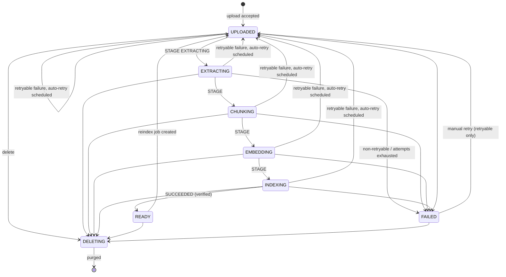
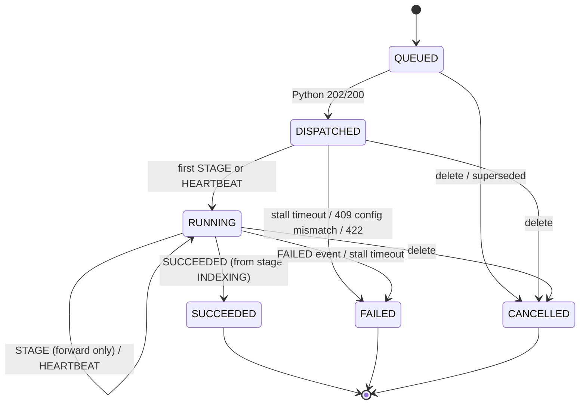

# Document Lifecycle, Jobs, Reindexing and Consistency

MySQL is authoritative for document and job state. ChromaDB and the storage volume are made
consistent with MySQL. This file covers the conditional approvals:
- **A7:** reindex safety.
- **A9:** in-process worker reliability.

## 1. Document states



| State | UI (`ui_state` / label) | In Q&A scope | Set by |
| --- | --- | --- | --- |
| `UPLOADED` | `uploaded` / Yüklendi (Sıraya alındı) | No | Upload; job (re)created |
| `EXTRACTING` | `reading` / Okunuyor | No | Event from the active job |
| `CHUNKING`, `EMBEDDING`, `INDEXING` | `preparing` / Hazırlanıyor | No | Event from the active job |
| `READY` | `ready` / Hazır | **Yes** | `SUCCEEDED` event, after the guards in §3.3 |
| `FAILED` | `error` / Sorun var | No | `FAILED` event or sweeper, with no automatic attempts left |
| `DELETING` | hidden | No | User/admin delete |

- **A document is available for Q&A if and only if** `status = READY ∧ deletedAt IS NULL` and
  the user may see it ([api-contracts.md §5](api-contracts.md#5-authorized-scope-derivation)).
- **No other state is ever in scope**, so partially written chunks are never retrievable.
- **`MIGRATION` jobs never change `Document.status`** (§8).

## 2. Job states



- **Terminal states are immutable.** Any later event for the job is answered with
  `409 STALE_JOB`.
- **Stages only move forward:** `EXTRACTING < CHUNKING < EMBEDDING < INDEXING`. Repeating the
  current stage is allowed; moving backwards is `409 INVALID_TRANSITION`.

## 3. Job creation and dispatch

### 3.1 Creation (one transaction)
```sql
INSERT INTO DocumentProcessingJob (id, documentId, indexVersionId, kind, status, attempt, indexingVersion, nextAttemptAt)
VALUES (:job, :doc, :iv, :kind, 'QUEUED', :attempt, :indexingVersion, :notBefore);

UPDATE Document
   SET activeJobId = :job,
       status = CASE WHEN :kind = 'MIGRATION' THEN status ELSE 'UPLOADED' END,
       errorCode = NULL, errorMessage = NULL, errorRetryable = NULL, failedStage = NULL
 WHERE id = :doc AND activeJobId IS NULL AND deletedAt IS NULL;
-- affected rows must be 1, otherwise ROLLBACK → 409 JOB_ALREADY_RUNNING (or 404 if deleted)
```

- **At most one job per document, of any kind,** is active (`Document.activeJobId`, unique).
  Concurrent retry clicks, a reindex racing a retry, or a migration racing a retry cannot run
  in parallel.
- **`indexVersionId`:** the `ACTIVE` version for `INITIAL`/`RETRY`/`REINDEX`; the `BUILDING`
  version for `MIGRATION`.
- **`indexingVersion`:** that index version's `chunkerVersion`, unless an admin reindex
  specifies another.

### 3.2 Dispatch
1. **Claim:** `UPDATE job SET status='DISPATCHED', dispatchedAt=now() WHERE id=:job AND status='QUEUED'`.
   Proceed only if one row changed, so two NestJS instances never dispatch the same job.
2. **Send:** `POST /api/v1/ingestion/jobs` and handle the response per
   [api-contracts.md §8.1](api-contracts.md#81-post-apiv1ingestionjobs). On back-pressure or
   a connection error, revert to `QUEUED` with `nextAttemptAt = now() + 30 s`.
3. **Dispatcher loop:** every 10 s, dispatch `QUEUED` jobs whose `nextAttemptAt ≤ now()`.
   This also recovers jobs left behind if NestJS restarted between commit and dispatch.

### 3.3 Applying events (one transaction per event)
```text
lock job FOR UPDATE; lock document FOR UPDATE
if job is terminal                                  → 409 STALE_JOB
if document.activeJobId ≠ job.id or document.deletedAt is not null
                                                    → 409 STALE_JOB
if event.seq ≤ job.lastEventSeq                     → 200 {applied:false, DUPLICATE_EVENT}
if event.attempt ≠ job.attempt or event.document_id ≠ job.documentId
                                                    → 422
validate transition (§2)                            → else 409 INVALID_TRANSITION
job.lastEventSeq = seq; job.heartbeatAt = now(); job.workerId = event.worker_id
STAGE:      job.status = RUNNING, job.stage = stage; if kind ≠ MIGRATION: document.status = stage
HEARTBEAT:  job.status = RUNNING
SUCCEEDED:  require stage = INDEXING and result.indexing_version = job.indexingVersion
            and result.collection = job.indexVersion.collectionName
            and result.embedding_fingerprint = job.indexVersion.embeddingFingerprint
            job → SUCCEEDED (pageCount, chunkCount, finishedAt)
            document.activeJobId = NULL
            if kind ≠ MIGRATION:
               require job.indexVersion is ACTIVE (else: requeue a new job against ACTIVE; see §8.4)
               document.status = READY; readyAt = now(); pageCount, chunkCount,
               indexingVersion = result.indexing_version, indexVersionId = job.indexVersionId
FAILED:     job → FAILED (error*); apply retry policy (§5)
```

**READY is only ever written here.** It requires a `SUCCEEDED` event from the document's
active job, and Python sends that event only after read-back verification
([wbs2-handoff.md §4](wbs2-handoff.md#4-job-algorithm)). A failed, stalled, cancelled or
superseded job can never produce READY.

## 4. In-process worker reliability

The worker is an in-process queue inside the Python service (ADR-009).

**This is a bounded MVP solution, not a durable production queue:**
- Queued and running jobs are lost if Python restarts.
- Execution is **at-least-once**, made safe by idempotent jobs.
- Recovery depends on the NestJS sweeper, with a delay of up to the stall timeout plus
  backoff.
- A production deployment should replace it with a persistent queue (e.g. a DB-backed or
  Redis queue). The contracts in this folder stay unchanged, because NestJS owns job state.

### 4.1 Python worker obligations
| Obligation | Detail |
| --- | --- |
| Bounded | `INGEST_WORKER_CONCURRENCY` (default 1) worker threads; queue capacity `INGEST_QUEUE_CAPACITY` (20); `503 QUEUE_FULL` beyond that |
| Idempotent accept | In-memory registry `job_id → state`; a repeated `job_id` returns `200 duplicate:true` and is not queued twice |
| Per-document lock | At most one local job per `document_id`; another job for the same document returns `409 DOCUMENT_BUSY` |
| Heartbeats | A timer sends `HEARTBEAT` every `INGEST_HEARTBEAT_SECONDS` (30) while a job is running, independent of how long one embedding batch takes |
| Checkpoints | Before every stage and every Chroma write batch, check the local cancel flag and the last callback result. On `409 STALE_JOB`/`INVALID_TRANSITION`, **stop without further writes**. |
| Write tagging | Every chunk carries `x_job_id`; verification rejects foreign chunks ([wbs2-handoff.md §4](wbs2-handoff.md#4-job-algorithm)) |
| Graceful shutdown | Stop accepting; give the current job up to 20 s; otherwise send `FAILED(WORKER_SHUTDOWN, retryable)` best-effort for queued and running jobs |
| No durable state | Nothing is persisted locally; after a restart the registry is empty |

### 4.2 NestJS sweeper (every 30 s)
1. **Stall detection:** for jobs in `DISPATCHED`/`RUNNING` with
   `COALESCE(heartbeatAt, dispatchedAt) < now() − INGEST_STALL_TIMEOUT_SECONDS` (300), set the
   job to `FAILED(STALLED, retryable)` under row lock, then apply §5.
2. **Dispatch:** `QUEUED` jobs that are due (§3.2).
3. **Purge retry:** documents with `deletedAt IS NOT NULL AND purgedAt IS NULL`, every 5 min
   (§6).

### 4.3 Recovery scenarios
| Scenario | Outcome |
| --- | --- |
| Python restarts mid-job | No heartbeats → `STALLED` after ≤ 5 min → automatic `RETRY` job. The retry deletes the document's chunks first, so partial writes disappear. |
| Python restarts with queued jobs | Those jobs are `DISPATCHED` with no heartbeat → `STALLED` → retried |
| NestJS restarts | All state is in MySQL; the dispatcher and sweeper resume. Events during the downtime fail; Python retries terminal events for 2 min, otherwise the job stalls and is retried. |
| `SUCCEEDED` callback lost | Job stalls → retried → the pipeline runs again (idempotent) → READY. Costs one re-embedding. |
| Stalled-but-alive worker wakes up | Its job is terminal → its next event gets `409 STALE_JOB` → it aborts. Any batch it wrote after the new job started is found by `x_job_id` verification and deleted (§4.4). |
| Duplicate dispatch (two NestJS instances or a retry) | Conditional claim (§3.2) plus Python `job_id` dedup |
| Duplicate or out-of-order events | `seq` check |

### 4.4 Defences against duplicate execution (layered)
1. **MySQL:** one active job per document (conditional update + unique `activeJobId`).
2. **Dispatch claim:** `QUEUED → DISPATCHED` is a conditional update.
3. **Python:** dedups `job_id` and holds a per-document lock.
4. **Fencing:** every event is checked against `document.activeJobId` and the job's
   non-terminal state; stale workers are told to abort.
5. **Delete-first:** every job starts by deleting the document's chunks in its target
   collection.
6. **Tagged writes:** `x_job_id` on every chunk, plus read-back verification before
   `SUCCEEDED`:
   - `count(document_id = D) = chunk_count`, and
   - `count(document_id = D ∧ x_job_id ≠ J) = 0`.

   If foreign chunks are found, they are deleted and the count is checked again; if it still
   fails, the job fails with `VERIFICATION_FAILED` (retryable).

## 5. Error codes and retry policy

| Code | Stage | Retryable | `message_tr` (shown by NestJS) |
| --- | --- | --- | --- |
| `SOURCE_NOT_FOUND` | EXTRACTING | no | Dosya bulunamadı. Lütfen yeniden yükle. |
| `SOURCE_CHECKSUM_MISMATCH` | EXTRACTING | no | Dosya bulunamadı. Lütfen yeniden yükle. (ops alert: storage inconsistency) |
| `UNSUPPORTED_FORMAT` | EXTRACTING | no | Bu dosya biçimi desteklenmiyor. PDF yükleyebilirsin. |
| `ENCRYPTED_PDF` | EXTRACTING | no | Dosya parola korumalı. Korumasız bir kopya yükleyebilirsin. |
| `CORRUPT_PDF` | EXTRACTING | no | Dosya bozuk görünüyor. Yeniden yüklemeyi dene. |
| `NO_TEXT_LAYER` | EXTRACTING | no | Taranmış sayfalar okunamadı. Metin içeren bir PDF yükleyebilirsin. |
| `EMPTY_DOCUMENT` | EXTRACTING | no | Dosyada okunabilir metin bulunamadı. |
| `TOO_LARGE` | EXTRACTING | no | Dosya çok uzun (en fazla 400 sayfa). |
| `UNSUPPORTED_INDEXING_VERSION` | (dispatch) | no | Bir sistem sorunu oluştu. (ops alert) |
| `INDEX_CONFIG_MISMATCH` | (dispatch) / INDEXING | no | Bir sistem sorunu oluştu. (ops alert) |
| `EMBEDDING_FAILED` | EMBEDDING | yes | Hazırlanırken bir sorun oluştu; tekrar deneniyor. |
| `INDEX_UNAVAILABLE` | INDEXING | yes | 〃 |
| `VERIFICATION_FAILED` | INDEXING | yes | 〃 |
| `STORAGE_WRITE_FAILED` | INDEXING | yes | 〃 |
| `STALLED` | any | yes | 〃 |
| `WORKER_SHUTDOWN` | any | yes | 〃 |
| `INTERNAL` | any | yes | 〃 |

**Policy (applied in the same transaction that marks the job FAILED):**
- **Retryable, with `attempt < INGEST_MAX_AUTO_ATTEMPTS` (3):**
  - Create a new `RETRY` job with `attempt + 1` and `nextAttemptAt = now() + [60 s, 300 s][attempt−1]`.
  - `document.activeJobId` = the new job; `document.status = UPLOADED`.
- **Otherwise:**
  - `document.status = FAILED`, with `failedStage`, `errorCode`, `errorRetryable`.
  - `activeJobId = NULL`.
- **Manual retry** (`POST /documents/:id/retry`): allowed only for `FAILED ∧ errorRetryable`;
  starts a new episode at `attempt = 1`.
- **Non-retryable failures** require a new upload. Because `activeContentHash` keeps the
  failed row, the user deletes it first, or the UI offers "Sil ve yeniden yükle".

**Partial text layer:** pages without text become empty page texts. If more than
`INGEST_MAX_EMPTY_PAGE_RATIO` (0.5) of the pages are empty, the job fails with
`NO_TEXT_LAYER`. Otherwise it succeeds and reports `warnings: ["PAGES_WITHOUT_TEXT:n"]`.

## 6. Deletion

1. **NestJS (one transaction):**
   - `deletedAt = now()`, `status = DELETING`, `activeContentHash = NULL`.
   - Cancel the active job (`CANCELLED`) and set `activeJobId = NULL`.

   From this commit on, the document is **outside every scope and list**. Access is removed
   immediately, before any ChromaDB work. Any event from the cancelled job gets
   `409 STALE_JOB`.
2. **NestJS → Python:** `DELETE /api/v1/ingestion/documents/{id}/chunks` for **every
   collection not yet dropped** (`ACTIVE`, `BUILDING`, and `RETIRED`-but-not-dropped), so
   deleted content cannot survive in a rollback copy. Python also cancels a local job for the
   document.
3. **NestJS:** delete `documents/{id}/` from storage (original and all page artifacts).
4. **NestJS:** `purgedAt = now()`. If step 2 or 3 fails, `purgedAt` stays NULL and the sweeper
   retries every 5 min.
5. **Late writes** by a worker that had not yet seen the cancellation are removed by the next
   reconcile (§9). They are never retrievable meanwhile, because the document ID is not in any
   scope.

Rows are soft-deleted (kept for audit). A re-upload of the same file creates a new
`document_id` ([data-model.md §4](data-model.md#4-duplicate-uploads-with-soft-deletion)).

## 7. Reindexing (same embedding configuration)

**Triggers:**
- A new `indexing_version`, i.e. an extraction or chunking code change (mandatory: any change
  that can alter text, offsets or boundaries bumps it).
- An admin request.
- (Manual retry follows the same mechanics.)

**Mechanics:**
- A `REINDEX` job is created via §3.1, which sets the document to `UPLOADED` immediately.
- The job deletes the document's chunks in the ACTIVE collection, then rebuilds them.

**Consequences of delete-before-replace (accepted for the MVP, A7):**

| Consequence | Mitigation |
| --- | --- |
| The document is **unavailable for Q&A** from job creation until READY (typically minutes) | Bulk reindex is throttled: at most one document per course at a time, global concurrency 1, preferably off-peak. The UI shows Yüklendi/Okunuyor/Hazırlanıyor. |
| If the reindex **fails**, the document becomes `FAILED` with **no chunks**; there is no fallback to the old index | Automatic retries (§5). Old answers stay readable from their stored evidence excerpts. |
| A failed reindex never leaves the document READY | READY is written only by §3.3 |
| New `indexing_version` ⇒ new `chunk_id`s; old chunk IDs no longer resolve in ChromaDB | Stored answers keep their excerpts. The old page artifact `pages.{old}.json` is **kept**, so stored citations still open the right page and highlight. |
| Same `indexing_version` (retry) ⇒ identical chunk IDs and artifact, **provided extraction is deterministic** | WBS-2 pins extractor library versions; any change to them bumps `indexing_version` |
| The page artifact is replaced only on success | Written to a temp name and renamed after Chroma verification |

**Deferred alternative:** keeping old chunks live during a reindex needs a version filter in
WBS-3 retrieval (scope per `document_id → indexing_version`). That is an additive WBS-3
change, deferred (ADR-008).

## 8. Embedding model change (blue/green migration)

The old collection is **never modified** during a migration. It stays ACTIVE until the new
one is verified and activated, and it is kept afterwards for rollback.

1. **Create** an `IndexVersion` v2 (`BUILDING`) with the new `EmbeddingConfiguration`,
   collection `knot_chunks_v2`, and a new fingerprint. Python loads embedders per job
   configuration (cached by fingerprint). Two models in memory at once is a resource risk
   (R6).
2. **Build:** enqueue `MIGRATION` jobs for all live READY documents. They write **only** to
   v2 and use the normal activeJobId serialization, but never change `Document.status`.
   Documents stay READY and answer from v1.
3. **During the migration:**
   - New uploads and retries target v1 (ACTIVE); the migration loop later enqueues their v2
     job.
   - Deletions purge all non-dropped collections (§6).
   - A document reindexed during the migration needs its v2 job re-run; the gate catches
     this.
4. **Activation gate** (admin):
   1. Pause dispatch.
   2. Wait up to 10 min for running jobs, then cancel and requeue the rest.
   3. For every live READY document, require a `SUCCEEDED` `MIGRATION` job for v2 with
      `indexingVersion = document.indexingVersion`.
   4. Run `POST /api/v1/ingestion/verify` on v2 for every such document; every result must
      be `ok`.
   5. Check that the v2 stamp fingerprint equals `IndexVersion.embeddingFingerprint`.
   6. Recommended: run the locked retrieval set `challenge.v1` (on `feature/rag-core-pipeline`,
      commit `7bc6bb0`) against v2.
5. **Switch:**
   1. Deploy Python with `CHROMA_COLLECTION` and `EMBEDDING_*` for v2.
   2. The NestJS consistency guard ([api-contracts.md §6](api-contracts.md#6-consistency-guard-nestjs--python))
      confirms the fingerprint.
   3. In one transaction: v1 → `RETIRED`, v2 → `ACTIVE`, and `Document.indexVersionId = v2`
      for READY documents.
   4. Resume dispatch.
6. **Retention and rollback:**
   - v1 is kept at least 7 days, or until the next milestone demo.
   - Rollback is the reverse switch. Documents uploaded after the switch need a v1 job
     (catch-up) before rolling back; documents deleted after the switch were purged from v1
     too (§6).
7. **Drop:** delete the v1 collection and set `droppedAt`.

**Failure handling:**
- A failed migration job is retried like any job.
- Activation stays blocked until the gate passes; users are unaffected because v1 is still
  active.
- **Guard against cross-version writes:** a non-migration job created before activation that
  finishes afterwards fails the "job's index version is ACTIVE" check in §3.3. NestJS then
  requeues the document against the new ACTIVE version. It is never marked READY on a retired
  collection.

## 9. Stale-chunk cleanup (reconcile)

- **Schedule:** hourly, plus after any failed purge. For each non-dropped collection, call
  `POST /api/v1/ingestion/reconcile` with `live_document_ids` = all documents with
  `deletedAt IS NULL` (any status).
- **Effect:** chunks of unknown or deleted documents are removed.
- **Never targeted:** in-flight documents, which are live.
- **Empty-list protection:** see [api-contracts.md §8.3](api-contracts.md#83-post-apiv1ingestionreconcile).

Daily audit (recommended): `verify` all READY documents in the ACTIVE collection. A mismatch
creates a `REINDEX` job and an ops log entry.

## 10. Consistency invariants

| # | Invariant | Enforced by |
| --- | --- | --- |
| L1 | `READY` ⇒ the ACTIVE collection holds exactly `chunkCount` chunks for the document, all tagged with the job that set READY, and `pages.{indexingVersion}.json` exists | Python verification before `SUCCEEDED`; §3.3 guards; daily audit |
| L2 | In Q&A scope ⇔ `READY ∧ deletedAt IS NULL ∧ visible to the user` | NestJS scope derivation |
| L3 | ≤ 1 active job per document | Conditional update + unique `activeJobId` |
| L4 | Events are applied at most once and in order; terminal jobs are immutable | `seq`, row locks, transition table |
| L5 | No failure path writes READY | §3.3 is the only writer |
| L6 | Deleted ⇒ out of scope immediately; chunks and files purged eventually (bounded by sweeper and reconcile) | §6, §9 |
| L7 | Python serves queries from exactly one collection, matching the ACTIVE `IndexVersion` | Deployment config + consistency guard |
| L8 | ChromaDB is never used to decide access or status | Design rule |

## 11. Failure matrix

| Failure | Document ends in | Recovery |
| --- | --- | --- |
| Scanned PDF | `FAILED` (`NO_TEXT_LAYER`) | User uploads a text PDF |
| Chroma down during write | `UPLOADED` (auto-retry), then `FAILED` | Auto/manual retry; delete-first removes partial chunks |
| Embedding out of memory | 〃 (`EMBEDDING_FAILED`) | 〃 Lower the batch size (WBS-2 config) |
| Python crash or restart | `UPLOADED` after the stall timeout | Auto-retry |
| Callback lost | 〃 | 〃 |
| User double-clicks "Tekrar dene" | Unchanged; the second click gets `409 JOB_ALREADY_RUNNING` | — |
| Delete during processing | Hidden immediately | Purge + reconcile |
| Reindex fails | `FAILED`, no chunks | Retries; stored answers keep their excerpts |
| Migration job fails | Unchanged (READY on v1) | Retry; activation blocked |
| Config drift between Python and MySQL | Unchanged | Guard returns 503 to answers; ops fixes deployment |
