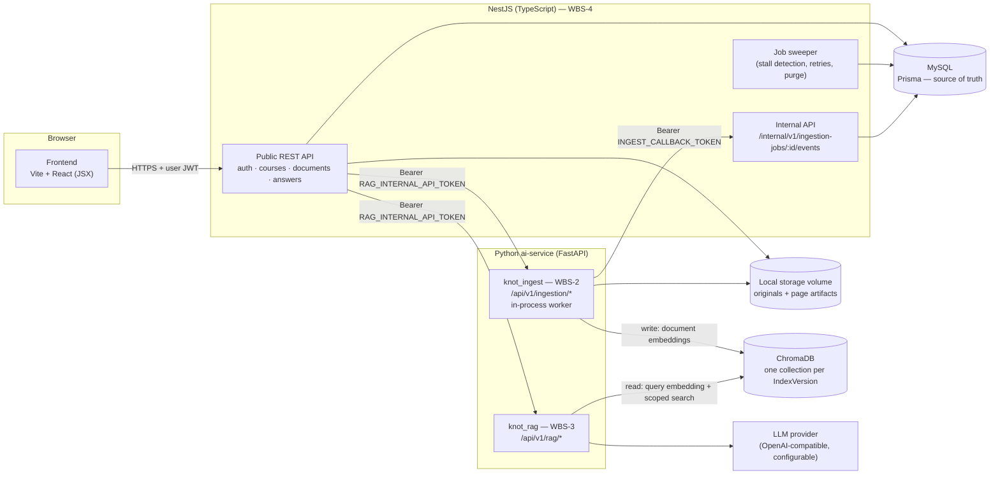
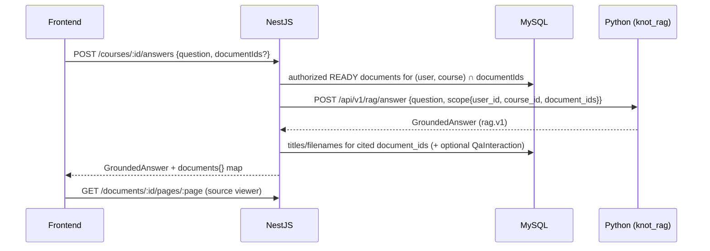

# K-not — System Overview (WBS-1)

> Status: **Accepted** by the team lead on 2026-10-07 (decisions A1–A9, see
> [architecture-decisions.md](architecture-decisions.md)). Contract version `rag.v1` / `ingest.v1`.
> Where this folder and `docs/rag-*.md` overlap, `docs/architecture/` is authoritative for
> cross-module rules; `docs/rag-*.md` remains authoritative for WBS-3 internals.

## 1. Purpose and scope

K-not is a source-grounded learning workspace. Students upload course PDFs, ask questions, and
receive answers whose claims are linked to identifiable passages of those PDFs. If the
materials do not support an answer, the system says so.

**Phase 1:**
- **In scope:** text-based PDF upload and indexing, source-grounded Q&A, multiple-choice,
  true/false and open-ended practice questions (WBS-6), answer evaluation (WBS-7), and
  grounding measurement (WBS-8).
- **Out of scope:** video, transcripts, OCR of scanned PDFs, PPT/DOC formats, teacher
  dashboards, social features.

## 2. What exists vs. what is proposed

| Component | State at `13ea172` | Owner |
| --- | --- | --- |
| Frontend (Vite + React 19, **JSX**, hash routing) | Exists; all data mocked (`src/data/*.js`) | WBS-5 |
| Python AI service (`ai-service/`, FastAPI): retrieval, grounded answers, citations | **Exists** (`rag.v1`, 170 tests) | WBS-3 |
| Python ingestion package (`ai-service/src/knot_ingest/`) | **Proposed**, specified in [wbs2-handoff.md](wbs2-handoff.md) | WBS-2 |
| NestJS backend + Prisma + MySQL | **Proposed**; no code on any branch | WBS-4 |
| ChromaDB | Used by WBS-3 through an adapter; no deployment config yet | WBS-2 (writes) / WBS-3 (reads) |
| Local file storage behind a `Storage` interface | Proposed | WBS-4 (interface), WBS-2 (artifacts) |
| Docker / CI | None | WBS-9 / WBS-10 |

## 3. Architecture



**Network rules**
- Only NestJS's public API is exposed to browsers.
- The ai-service, ChromaDB, MySQL, and NestJS's `/internal/*` routes are on a private network.
- Browsers never hold service credentials and never reach Python or ChromaDB. CORS is not a
  security control here.

## 4. Responsibilities in one paragraph each

- **NestJS** authenticates users and owns all relational data: users, courses, memberships,
  documents, processing jobs, index versions. It decides who may see which document and
  derives the *authorized scope* for every AI call. It orchestrates ingestion jobs and enforces
  job-state transitions. Details: [module-boundaries.md](module-boundaries.md) and
  [api-contracts.md](api-contracts.md).
- **Python (WBS-2, `knot_ingest`)** turns a stored PDF into page text, chunks, and document
  embeddings. It writes them to ChromaDB and reports progress to NestJS. It never touches MySQL.
  Spec: [wbs2-handoff.md](wbs2-handoff.md).
- **Python (WBS-3, `knot_rag`)** embeds questions, searches ChromaDB within the authorized
  scope, builds context, generates grounded answers, and validates citations. Spec:
  [`docs/rag-architecture.md`](../rag-architecture.md),
  [`docs/rag-api-contract.md`](../rag-api-contract.md).
- **ChromaDB** stores chunk text, chunk metadata, and vectors. It is a derived index and can be
  rebuilt from storage + MySQL. **MySQL is authoritative** whenever they disagree.

## 5. Main flows

### 5.1 Upload → READY

```mermaid
sequenceDiagram
  participant FE as Frontend
  participant N as NestJS
  participant DB as MySQL
  participant S as Storage
  participant P as Python (knot_ingest)
  participant C as ChromaDB
  FE->>N: POST /courses/:id/documents (multipart PDF)
  N->>S: stream to tmp/, compute SHA-256, check %PDF-
  N->>DB: INSERT Document(UPLOADED) — unique(course, owner, active hash)
  N->>S: rename tmp → documents/{id}/original.pdf
  N->>DB: INSERT Job(QUEUED); set Document.activeJobId (conditional UPDATE)
  N-->>FE: 201 Document {status: UPLOADED}
  N->>P: POST /api/v1/ingestion/jobs (job, document, source, index)
  P-->>N: 202 Accepted → Job DISPATCHED
  loop stages + heartbeat every 30 s
    P->>N: POST /internal/v1/ingestion-jobs/:id/events (seq n)
    N->>DB: validate fencing + transition, update Job / Document.status
  end
  P->>C: delete chunks(document_id) → upsert chunks (x_job_id) → read-back verify
  P->>S: write pages.{indexing_version}.json (atomic rename)
  P->>N: event SUCCEEDED {chunk_count, ...}
  N->>DB: Document READY (only if job still active and document not deleted)
  FE->>N: GET /courses/:id/documents (polling) → status "Hazır"
```

### 5.2 Question → grounded answer



### 5.3 Delete
NestJS soft-deletes the document, which removes it from every scope immediately, and cancels
any active job. It then asks Python to delete the chunks and finally removes the files. A
periodic reconcile catches anything left behind. See
[document-lifecycle.md §6](document-lifecycle.md#6-deletion).

## 6. Technology choices

| Layer | Choice | Note |
| --- | --- | --- |
| Frontend | Vite + React 19 + JSX, Tailwind 4 | Existing; **not** Next.js/TypeScript |
| Backend | NestJS + TypeScript, Prisma, MySQL 8 | MySQL 8 is required for the constraints used in [data-model.md](data-model.md) |
| AI service | Python ≥ 3.11, FastAPI, Pydantic 2 | Existing |
| Vector store | ChromaDB (server mode, cosine) | One collection per `IndexVersion` |
| Embeddings | sentence-transformers, **PROVISIONAL** model | [document-contract.md §4](document-contract.md#4-embeddingconfiguration) |
| LLM | OpenAI-compatible HTTP adapter | Provider not yet chosen (unresolved U2) |
| Storage | Local volume behind `Storage` interface | Replaceable by object storage later |

## 7. Document map

| Document | Answers |
| --- | --- |
| [module-boundaries.md](module-boundaries.md) | Who owns what; no duplicated chunking, embedding or search |
| [data-model.md](data-model.md) | MySQL entities, Prisma sketch, MySQL vs. Chroma ownership, duplicates |
| [document-contract.md](document-contract.md) | Canonical data contracts with JSON examples; WBS-3 compatibility |
| [api-contracts.md](api-contracts.md) | Public NestJS API, NestJS ↔ Python internal APIs, errors |
| [document-lifecycle.md](document-lifecycle.md) | State machines, jobs, retries, reindexing, migration, deletion |
| [architecture-decisions.md](architecture-decisions.md) | Decision record, risks, unresolved items |
| [wbs2-handoff.md](wbs2-handoff.md) | Everything WBS-2 needs to implement ingestion |
